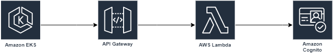

<h1> Infraestrutura AWS Cognito com Terraform </h1>
Este repositório contém a configuração de Infrastructure as Code (IaC) para gerenciar um Amazon Cognito User Pool usando Terraform. O Cognito User Pool permite o cadastro, login e controle de acesso seguro para os usuários das suas aplicações.

## Arquitetura:

## Documentação:
[AWS Lambda Documentation](https://aws.amazon.com/pt/pm/lambda/)

[AWS Powertools (python)](https://docs.powertools.aws.dev/lambda/python/latest/core/event_handler/api_gateway/)

[AWS Cognito Documentation](https://aws.amazon.com/pt/cognito/?nc2=type_a)

[API Gateway Documentation](https://aws.amazon.com/pt/api-gateway/?nc2=type_a)

[Terraform Documentation](https://registry.terraform.io/providers/hashicorp/aws/latest/docs)

[GitHub Actions Documentation](https://docs.github.com/pt/actions)